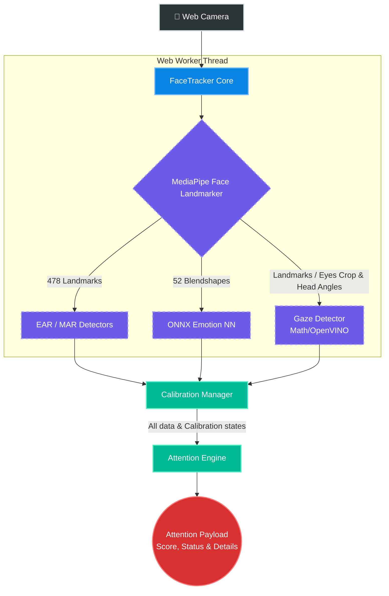

# Attention Tracker

[](https://www.npmjs.com/package/attention-tracker)
[](https://opensource.org/licenses/MIT)
[](https://www.typescriptlang.org/)
[](https://developers.google.com/mediapipe)
[](https://onnxruntime.ai/)


_[ Note: GIF playback may appear choppy due to compression and screen recording limitations; the actual library runs smoothly in real-time. [Watch full high-quality MP4 versions on Google Drive](https://drive.google.com/drive/folders/1_zvS6miXcpxELTOPM7FpQBrXFNIgBTU8?usp=sharing) ]_

**Attention Tracker** is a lightweight, real-time engagement analytics library for detecting focus, distraction, drowsiness, gaze behavior, and emotional states directly in the browser.

Designed for edge computing, it analyzes facial expressions, eye movements, and head pose **locally on the user's device**. This ensures zero-latency feedback and 100% privacy, as no sensitive video data is ever transmitted to external servers.

Compatible with all modern frontend frameworks including Next.js, Vue.js, Angular, Nuxt, Svelte, and vanilla JavaScript/TypeScript bundlers (Webpack, Vite, Rollup).

---

## 🎯 Broad Use Cases

While originally designed for **adaptive educational interfaces (e-learning) and video conferences**, the core engine is highly versatile:

- **Safety & Driver Monitoring:** Detect drowsiness, microsleeps, and erratic gaze behavior.
- **Productivity & Self-Control:** Monitor focus levels and manage distractions during deep work.
- **UX/UI Research:** Understand user frustration or focus zones during product testing.
- **Telehealth & Therapy:** Monitor patient behavior and emotional states during remote sessions.

---

## Key Features & Under the Hood

- **Real-time Processing:** Optimized to run seamlessly in the browser using WebAssembly and Web Workers, preventing UI blocking.
- **Custom Proprietary Emotion Model:** Uses a unique, custom built and trained neural network model to classify emotional states (Focus, Thinking, Neutral, Happy, Sad).
- **Gaze Estimation:** Employs a strategy pattern utilizing either fast geometric calculations (`math`) or a highly accurate OpenVINO neural network (`openvino`).
- **Graceful Degradation:** Automatically downgrades from heavy NN models to mathematical approximations (`auto` strategy) to maintain FPS on low-end devices.
- **Blink & Yawn Detection:** Dynamically calculates Eye Aspect Ratio (EAR) and Mouth Aspect Ratio (MAR) with auto-adjusting thresholds to detect microsleeps, drowsiness, and yawning.
- **Auto-Calibration:** Adapts to the user's posture, camera angle, and distance dynamically.

---

## 📦 Installation

Install the library via npm:

```bash
npm install attention-tracker

```

### Assets & Models Setup

Out of the box, the library fetches required WebAssembly binaries and models from CDNs (e.g., jsdelivr). You don't need to configure anything to get started!

However, if you want an **offline setup** or want to host the models yourself:

1. Download the `models` folder from the **[`public/models`](https://github.com/P3Lin0r/attention-tracker/tree/main/public/models)** directory of this repository or CDNs.
2. Place it in your project's `public` directory.
3. Pass your custom paths to the `assets` object when initializing the library.

---

## Usage (Vanilla JS/TS)

Using the library is straightforward. You only need to provide configuration overrides if you want to change the defaults (the default config runs off-thread, uses the CPU backend, and auto-manages gaze strategies).

### 1. Initialization

Create an instance of the monitor. You can pass an optional configuration object. To see all default values, check out the **[`DEFAULT_CONFIG`](https://github.com/P3Lin0r/attention-tracker/blob/main/src/config/defaults.ts)** and **[`types`](https://github.com/P3Lin0r/attention-tracker/blob/main/src/types.ts)** _(CONFIGURATION INTERFACES)_ in the source code. You can fully customize thresholds, time windows, and penalty weights via the configuration object.

```typescript
import { AttentionMonitor } from "attention-tracker";

// Creates a monitor with default settings (CDN assets, Web Worker enabled)
const monitor = await AttentionMonitor.create();

// OR with custom configuration:

const monitor = await AttentionMonitor.create({
  worker: true,
  backend: "GPU",
  gazeStrategy: "openvino",
  assets: {
    models: {
      emotion: "/my-local-path/emotion_model.onnx", // Use local model
    },
    settings: {
      engine: {
        timeToConfirm: 500, // Ms required to confirm a status change (debouncing)
        weights: {
          gaze: 0.5,
          perclos: 0.35,
          yawn: 0.15,
        },
        adhdDynamics: {
          enabled: true, // Enable ADHD status calculations
        },
      },
      blink: {
        perclosDrowsyThreshold: 0.15, // % of eye closure to trigger drowsiness
        microsleepLimit: 2, // Seconds of continuous eye closure
      },
    },
  },
});
```

### 2. Subscribing to Events & Starting

Listen to the `attention` event to get real-time data, then start the tracker by passing an HTML Video element.

```typescript
// Listen to results
monitor.on("attention", (result) => {
  console.log(`Status: ${result.status} | Score: ${result.score}`);

  if (result.status === "MICROSLEEP") {
    console.warn("MICROSLEEP detected, user losing focus!");
  }
});

monitor.on("error", (err) => console.error("Monitor Error:", err));

// Start processing the video stream
const videoElement = document.getElementById("user-video") as HTMLVideoElement;
monitor.start(videoElement);
```

### 3. Understanding the Payload (`AttentionResult`)

Every frame, the `attention` event emits a comprehensive payload containing everything from the high-level semantic status to raw tracking data:

```typescript
{
  status: "NORMAL", // "DISTRACTED" | "NORMAL" | "DROWSY" | "MICROSLEEP" | "FATIGUED" | "ADHD" | "NOT_DETECTED"
  score: 0.95,  // 0.0 to 1.0
  details: {
    penalties: { gaze: 0, perclos: 0, yawn: 0, emotionModifier: 1 },
    isADHD: false,
    direction: {
      headAngles: [yaw, pitch, roll],
      gazeVector: [x, y, z]
    }
  },
  signals: {
    emotion: "FOCUSED", // Evaluated by the custom neural network model
    blink: { status: "DROWSY", count: 12, perclos: 0.17, threshold: 0.64 },
    yawn: { status: "YAWNING", count: 3, threshold: 1.5 },
    raw: { ear: 0.2, mar: 0.7 },
    performance: { latency: 33.15, isDowngraded: false, activeModel: "OPENVINO" }
  },
  snapshot: { /* Raw geometric data */ },
  calibration: { /* User's baseline data */ }
}

```

---

## ⚛️ Usage in React (Recommended)

The library provides a built-in React hook **[`useAttentionMonitor`](https://github.com/P3Lin0r/attention-tracker/blob/main/src/hooks/react/useAttentionMonitor.ts)** that handles the entire lifecycle, model loading, and Web Worker cleanup automatically.

```tsx
import { useRef } from "react";
import { useAttentionMonitor } from "attention-tracker";

export default function App() {
  const videoRef = useRef<HTMLVideoElement>(null);

  const { result, isReady, error } = useAttentionMonitor(
    videoRef,
    {
      worker: true,
      backend: "CPU",
      gazeStrategy: "auto",
    },
    {
      autoStart: true,
      throttleStateMs: 100, // Limits re-renders to every 100ms for performance
    },
  );

  return (
    <div>
      <video ref={videoRef} autoPlay muted playsInline />

      {!isReady && <p>Loading models...</p>}
      {error && <p>Error: {error.message}</p>}

      {result && (
        <div className="dashboard">
          <h2>Status: {result.status}</h2>
          <p>Attention Score: {Math.round(result.score * 100)}%</p>
          <p>Emotion: {result.signals.emotion}</p>
        </div>
      )}
    </div>
  );
}
```

### ⚡ React Performance Tip

Tracking could run at high framerates (up to 30-60 FPS). Updating React state on every single frame will cause severe performance issues and UI lag.

To prevent this, use **`throttleStateMs`** to slow down state updates to a comfortable rate (e.g., 100-250ms). If you need to perform high-frequency tasks like drawing landmarks on an HTML `<canvas>`, use the **`onUpdate`** callback in the hook options, which executes every frame **without triggering** a React re-render. You can find more detailed information with examples, at **[`useAttentionMonitor`](https://github.com/P3Lin0r/attention-tracker/blob/main/src/hooks/react/useAttentionMonitor.ts)**.

---

## **Running the Demos Locally**


Want to see it in action or test it locally? This repository includes ready-to-use demos for both Vanilla TS and React.

**1. Clone the repository:**

```bash
git clone https://github.com/P3Lin0r/attention-tracker.git

cd attention-tracker

```

**2. Install dependencies:**

```bash
npm install

```

**3. Run the preferred demo:**

Provided **three** distinct demos to help you understand, test, and integrate the library. You can run them locally to see the system in action:

- **📸 The Playground (Vanilla TS)**

  Want to see the raw power of the tracker? This demo connects to your webcam and visualizes everything in real-time. Watch your Eye Aspect Ratio (EAR), Mouth Aspect Ratio (MAR), and 3D gaze vectors dynamically change on live canvas graphs. It displays a complete breakdown of penalties and raw signals, making it the perfect sandbox to test the library on yourself and fine-tune configuration thresholds.

  **Run: `npm run dev` or `npm run dev:vanilla-ts`**

- **⚛️ React Minimal**

  Built specifically for frontend developers. This demo showcases how incredibly simple it is to drop the tracker into a modern React application. It utilizes the built-in useAttentionMonitor hook to handle the entire complex lifecycle, Web Workers initialization, and state updates with practically zero boilerplate.

  **Run: `npm run dev:react`**

- **👥 Group Attention Dashboard (Video Grid)**

  A production-ready simulation of a video conference **(like Zoom or Google Meet)**. This demo processes multiple video streams simultaneously and aggregates the individual metrics into a high-level Global Group Status (e.g., dynamically alerting you if the "AUDIENCE FALLING ASLEEP ⚠️" or if they are "HIGHLY ENGAGED ✅"). It perfectly demonstrates how to scale the library's business logic for **e-learning platforms and analytics dashboards**.

  ❗ _To use it, place your **videos** into the `public/videos` folder and add their relative paths to the `VIDEO_SOURCES` array in `main.ts`. You can download some videos from *[Google Drive](https://drive.google.com/drive/folders/19-Enk7PEw6ylyieC4Ql4gEEhod_khA7G?usp=sharing)*_

  **Run: `npm run dev:dashboard`**

_(Demos are configured to resolve internal imports seamlessly without needing a production build first)._

---

## 🛠️ Configuration Power

Thanks to its highly flexible configuration, you can adapt the engine to track almost any engagement metric. Review the Driver Monitoring setup below to understand the logic and power of custom thresholds.

### Driver Monitoring System (Safety Profile)


_**[ Notice how quickly the system adapts to the situation after startup, while keeping the status stable without erratic changes. ]**_ _[Watch full high-quality MP4 on Google Drive](https://drive.google.com/file/d/1WVnYzKvrypxGM85wi5CRjq2D6LFNrsvh/view?usp=sharing)_

The default configuration is tuned for **office/e-learning** scenarios. However, the `AttentionEngine` is fully customizable. Here is how you can reconfigure it for **Driver Monitoring**, where microsleeps are fatal and users constantly check mirrors.

**You can understand why and how to change values for your purposes and tasks.**

```typescript
const driverConfig = {
  settings: {
    blink: {
      // A 2-second microsleep at 100km/h is lethal. Drop the limit to 0.8 seconds.
      microsleepLimit: 0.7,
      // Strict fatigue monitoring: lower the PERCLOS threshold to catch early signs of drowsiness.
      perclosDrowsyThreshold: 0.15,
    },
    engine: {
      // React faster to dangerous states. Reduce debounce time from 500ms to 200ms.
      timeToConfirm: 200,
      gazeDynamics: {
        // Drivers MUST check mirrors. Widen the horizontal deadzone to 35° so looking left/right doesn't immediately penalize.
        yawDeadzone: 35,
        // Penalize vertical drops (looking at phone/lap) much more harshly than horizontal (mirrors).
        pitchScale: 15,
      },
      weights: {
        // Note: These weights govern the "soft" attention score calculation.
        // Critical events (like MICROSLEEP) act as hard overrides and instantly drop the score to 0.
        // Shift the penalty weights. Fatigue is much deadlier than being momentarily distracted.
        perclos: 0.65, // Eyes closing is the most critical fatigue indicator
        yawn: 0.3, // Yawning is a huge red flag
        gaze: 0.15, // Forgive mirror checking (lower weight compared to e-learning)
      },
      adhdDynamics: {
        // Disable ADHD/hyperactivity detection. Tracking fidgeting is irrelevant for driving safety.
        adhdWeights: {
          gaze: 0,
          head: 0,
        },
      },
      modifiers: {
        // Disable emotional forgiveness. A "focused" driver looking at their phone is still distracted.
        // Keeping these at 1.0 ensures raw penalty data remains objective.
        emotionFocused: 1,
        emotionThinking: 1,
        // Increase the flat score penalty applied during an active yawn.
        yawnPenalty: 0.6,
      },
    },
  },
};

const dashcamMonitor = await AttentionMonitor.create(driverConfig);
```

---

## 🧠 Architecture Overview

The tracking pipeline is designed for maximum throughput. It offloads heavy tensor operations to Web Workers while keeping the main thread free for UI rendering.



### 📂 Directory Structure

Here is a quick overview of the library's internal structure for contributors:

```text
src/
├── api/            # Public entry points (AttentionMonitor, EventEmitters)
├── core/           # Face tracking orchestrator and performance monitors
│   └── history/    # Zero-allocation circular buffers for time-series math
├── detectors/      # Isolated modules for specific detections
│   ├── gaze/       # Gaze strategies (Math geometry vs OpenVINO)
│   ├── BlinkDetector.ts    # EAR-based microsleep/drowsiness logic
│   ├── EmotionsDetector.ts # ONNX Model execution
│   └── YawnDetector.ts     # MAR-based yawning logic
├── analytics/      # High-level logic aggregating raw detector signals
│   └── CalibrationManager.ts # Adapts to user's posture changes
│   ├── AttentionEngine.ts    # Aggregates data to a final score & status with debouncing
├── hooks/          # Integrations with frameworks (useAttentionMonitor)
├── workers/        # Web Worker entry points for off-thread processing
└── config/         # Default configurations and type definitions

```

## ⚖️ License & Acknowledgments

This project is licensed under the **MIT License** - see the [LICENSE](https://github.com/P3Lin0r/attention-tracker/blob/main/LICENSE) file for details.

This library is built upon several open-source technologies. I would like to thank their creators and maintainers:

- **[MediaPipe Tasks Vision](https://github.com/google/mediapipe)** by Google (Licensed under Apache 2.0). Utilized for highly optimized facial landmark detection.
- **[ONNX Runtime Web](https://github.com/microsoft/onnxruntime)** by Microsoft (Licensed under MIT). The core inference engine for our neural networks.
- **[OpenVINO Model Zoo (OMZ)](https://github.com/openvinotoolkit/open_model_zoo)** by Intel (Licensed under Apache 2.0). I use the `gaze-estimation-adas-0002` topology for precise eye-tracking.
